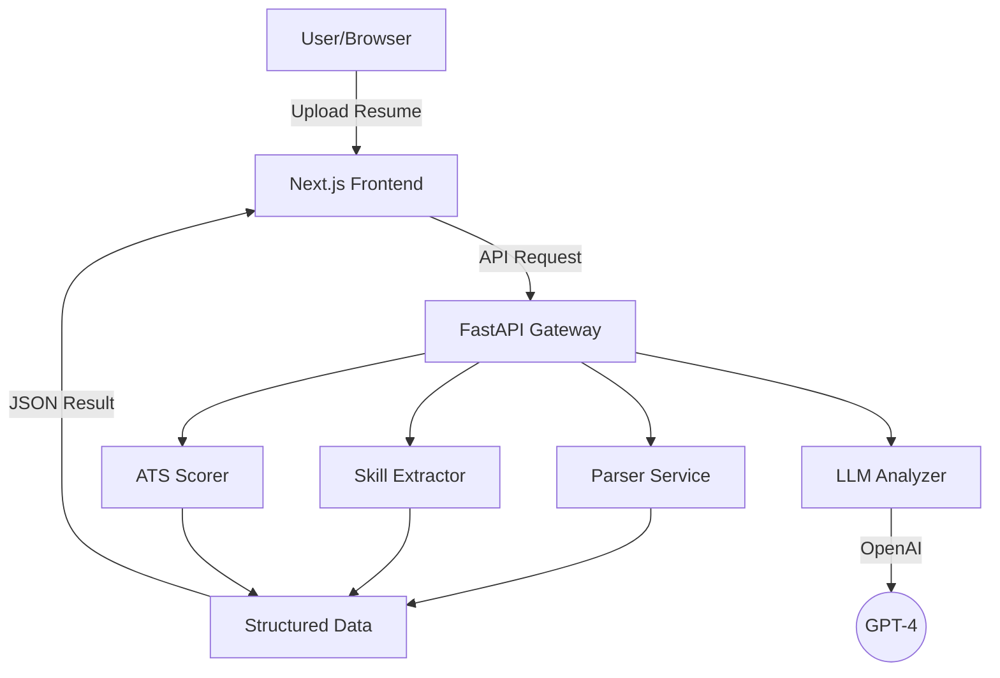

# Resume-IQ: Next-Gen AI Resume Scanner & ATS Analyzer


Resume-IQ is a professional-grade AI-powered platform designed to bridge the gap between job seekers and Applicant Tracking Systems (ATS). Leveraging advanced NLP and LLM technologies, it provides deep insights into resume performance, skill alignment, and even potential fraud detection.

---

## 🚀 Key Features

- **ATS Score Optimization**: Get real-time feedback on how well your resume performs against modern ATS algorithms.
- **LLM-Powered Analysis**: Deep contextual insights powered by OpenAI to improve content quality and impact.
- **Advanced Skill Extraction**: Automatically identifies technical and soft skills using spaCy and custom NLP pipelines.
- **Fraud & Anomaly Detection**: Sophisticated logic to detect inconsistencies and ensure resume integrity.
- **Intelligent Parsing**: Seamlessly handles PDF and DOCX formats with high-fidelity text extraction.
- **Similarity Matching**: Compare your resume against job descriptions to identify missing keywords and skills.

---

## 🛠️ Tech Stack

- **Frontend**: Next.js 14, Tailwind CSS, TypeScript, Framer Motion
- **Backend**: FastAPI (Python 3.10+), spaCy (NLP), OpenAI API
- **Infrastructure**: Docker, Docker Compose
- **DevOps**: Production-ready multi-stage Docker builds

---

## 🏗️ Architecture



---

## 🚦 Getting Started

### Prerequisites

- Python 3.10+
- Node.js 18+
- Docker & Docker Compose
- OpenAI API Key

### Local Development

#### 1. Backend Setup
```bash
cd backend
python -m venv venv
source venv/bin/activate  # venv\Scripts\activate on Windows
pip install -r requirements.txt
python -m spacy download en_core_web_sm
cp .env.example .env # Add your OpenAI API Key
uvicorn app.main:app --reload
```

#### 2. Frontend Setup
```bash
cd frontend
npm install
npm run dev
```

### 🐳 Docker Deployment (Recommended)

Run the entire stack with a single command:

```bash
docker-compose up --build
```

For production-grade deployment:
```bash
docker-compose -f docker-compose.prod.yml up --build -d
```

---

## 📄 License

Distributed under the MIT License. See `LICENSE` for more information.

---

## 🤝 Contributing

Contributions are what make the open source community such an amazing place to learn, inspire, and create. Any contributions you make are **greatly appreciated**.

1. Fork the Project
2. Create your Feature Branch (`git checkout -b feature/AmazingFeature`)
3. Commit your Changes (`git commit -m 'Add some AmazingFeature'`)
4. Push to the Branch (`git push origin feature/AmazingFeature`)
5. Open a Pull Request

---

<p align="center">Built by Ananthapadmanabhan for better careers</p>
